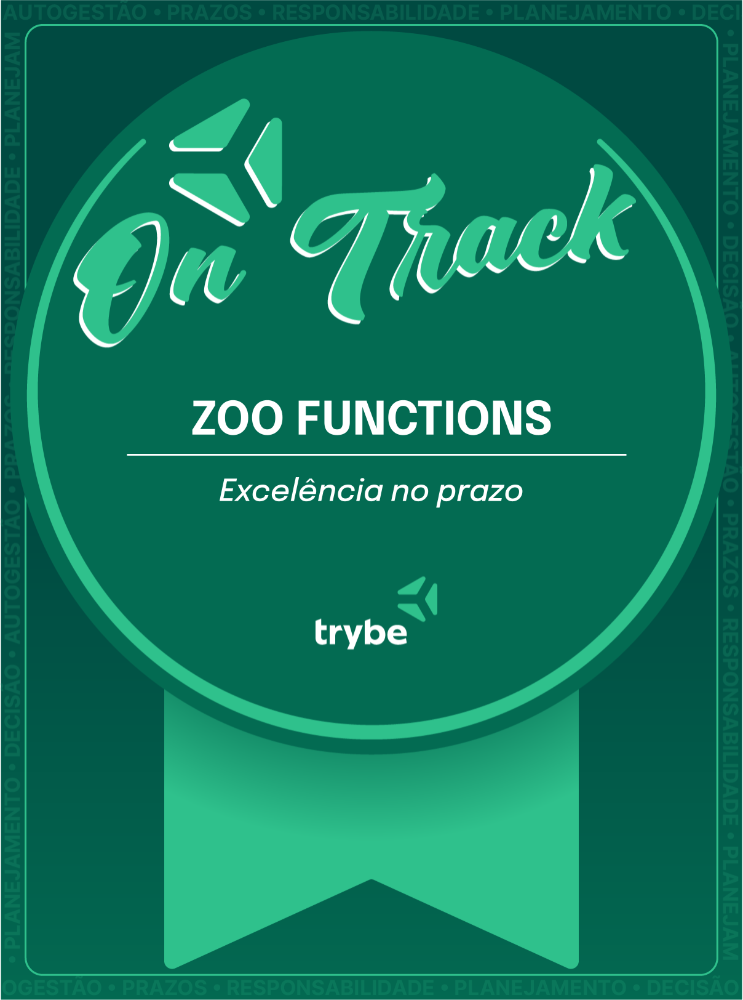

# :heavy_check_mark: README :heavy_check_mark:

  <h1> Todos arquivos nas pastas "src" e "test" foram desenvolvidos por mim :smiley: </h1>
  <h1> Configurações de lint, e depêndencias foram feitas pela Trybe </h1>

  <h2> Projeto com 100% de aprovação: Feito em java scripts durante o módulos de Fundamentos da Trybe, ultilizando muitas HOFs
  destructuring e outras funções nativas do JS. :wink: </h2>

  <h2>Selo de aprovação</h2>
  

